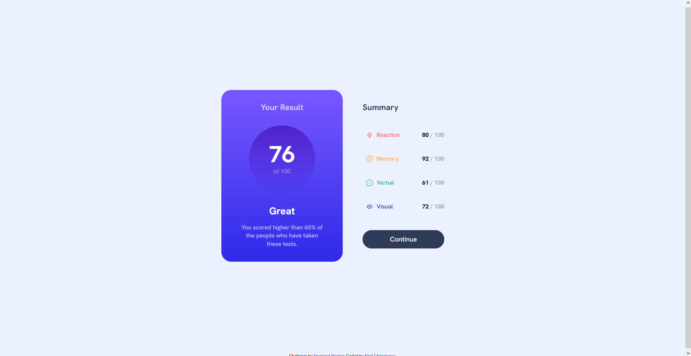

# Frontend Mentor - Results summary component solution

This is a solution to the [Results summary component challenge on Frontend Mentor](https://www.frontendmentor.io/challenges/results-summary-component-CE_K6s0maV). Frontend Mentor challenges help you improve your coding skills by building realistic projects. 

## Table of contents

- [Overview](#overview)
  - [The challenge](#the-challenge)
  - [Screenshot](#screenshot)
  - [Links](#links)
- [My process](#my-process)
  - [Built with](#built-with)
  - [What I learned](#what-i-learned)
- [Author](#author)

## Overview

### The challenge

Users should be able to:

- View the optimal layout for the interface depending on their device's screen size
- See hover and focus states for all interactive elements on the page

### Screenshot

### Links

- Solution URL: [https://polite-halva-b2f6a7.netlify.app](https://polite-halva-b2f6a7.netlify.app)

## My process

### Built with

- Semantic HTML5 markup
- CSS custom properties
- Flexbox
- CSS Grid
- Mobile-first workflow

### What I learned

- use of `fetch`{.js} to read the data from json
- use of `template`{.html} to insert the similarly structured data
- use of `color-mix`{.css} to mix the colors in css. This feature is somewhat experimental, since only 75% of users will be able to see it, but it is a nice notice for the future. 

## Author

- Website - [Add your name here](https://www.your-site.com)
- Frontend Mentor - [@skyrimer](https://www.frontendmentor.io/profile/skyrimer)
